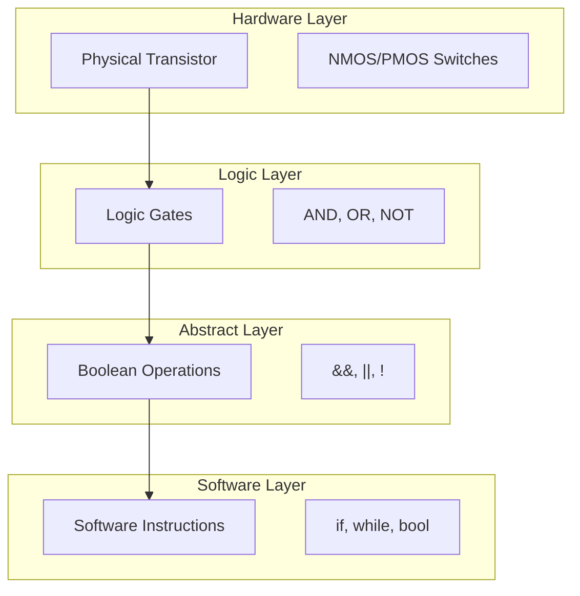

- [Foundation Path 1: Computer Hardware \& Architecture](#foundation-path-1-computer-hardware--architecture)
  - [Digital Logic Fundamentals](#digital-logic-fundamentals)
      - [Supplementary Resources](#supplementary-resources)
    - [Evolution of Computing Components](#evolution-of-computing-components)
    - [Modern Semiconductor Evolution](#modern-semiconductor-evolution)
      - [Current Manufacturing Process](#current-manufacturing-process)
      - [Current Challenges \& Future](#current-challenges--future)
    - [Binary \& Boolean Algebra](#binary--boolean-algebra)
      - [Supplementary Resources](#supplementary-resources-1)
      - [Why Computers Use Binary](#why-computers-use-binary)
      - [Boolean Algebra \& Operations](#boolean-algebra--operations)
  - [Hardware Implementation](#hardware-implementation)
    - [Transistor-level implementation](#transistor-level-implementation)
    - [Supplementary Resources](#supplementary-resources-2)
      - [Transistors as Binary Switches](#transistors-as-binary-switches)
  - [Understanding Transistor Physics for Computer Science](#understanding-transistor-physics-for-computer-science)
    - [The Physics Behind Binary States](#the-physics-behind-binary-states)
    - [CMOS Technology and Complementary Operation](#cmos-technology-and-complementary-operation)
    - [Timing and Power Considerations](#timing-and-power-considerations)
    - [Critical Software Implications](#critical-software-implications)
  - [Logic Gates](#logic-gates)
    - [Supplementary Resources](#supplementary-resources-3)
    - [Introduction to Logic Gates](#introduction-to-logic-gates)
      - [Gate Categories Overview](#gate-categories-overview)
    - [Fundamental Gates (AND, OR, NOT)](#fundamental-gates-and-or-not)
      - [Common Characteristics](#common-characteristics)
      - [AND Gate](#and-gate)
      - [OR Gate](#or-gate)
      - [NOT Gate (Inverter)](#not-gate-inverter)
    - [Universal Gates (NAND, NOR)](#universal-gates-nand-nor)
      - [Why They're Universal](#why-theyre-universal)
      - [NAND Gate](#nand-gate)
      - [NOR Gate](#nor-gate)
    - [Composite Gates (XOR, XNOR)](#composite-gates-xor-xnor)
      - [XOR Gate (Exclusive OR)](#xor-gate-exclusive-or)
      - [XNOR Gate (Exclusive NOR)](#xnor-gate-exclusive-nor)
    - [Gate-Level Optimization](#gate-level-optimization)
      - [Why Optimization Matters](#why-optimization-matters)
      - [Minimization Techniques](#minimization-techniques)
    - [Practical Implications](#practical-implications)
      - [Circuit Design](#circuit-design)
      - [Performance Impact](#performance-impact)
      - [Best Practices](#best-practices)


# Foundation Path 1: Computer Hardware & Architecture

## Digital Logic Fundamentals

#### Supplementary Resources
- [Early Computing: Crash Course Computer Science #1](https://youtu.be/O5nskjZ_GoI?si=hiBF9Q2kLwn-iArr)
- [Electronic Computing: Crash Course Computer Science #2](https://youtu.be/LN0ucKNX0hc?si=ds4qlzPHKg8qYzZF)
- [Relay vs Vacuum Tube vs Transistor](https://images.app.goo.gl/9sBsLCKZoj3zP5H86)

### Evolution of Computing Components
- **Relays (1930s-40s)**
  - Electromechanical switches that used electromagnets to physically move metal contacts, making or breaking electrical connections
  - Think of them like electronic versions of light switches, but automated
  - While revolutionary for their time, they were slow (operating at milliseconds), bulky, and prone to mechanical failure
  - Historical example: Harvard Mark I computer showed both the potential and limitations of relay-based computing

- **Vacuum Tubes (1940s-50s)**
  - A major leap forward: controlled electron flow through a vacuum-sealed glass tube
  - Much faster than relays (operating at microseconds) and had no moving parts
  - However, they generated significant heat, consumed lots of power, and were fragile
  - The ENIAC computer demonstrated their potential and challenges: using about 18,000 vacuum tubes, it consumed 150 kilowatts of power - enough to power a small neighborhood!

- **Transistors (1950s-present)**
  - The revolution that enabled modern computing
  - Made from semiconductor materials like silicon
  - Perform the same switching functions as vacuum tubes but with massive improvements:
    - Incredibly small (modern transistors are nanometers in size - thousands could fit across a human hair)
    - Highly reliable (no vacuum seal to break)
    - Energy efficient (generating far less heat)
    - Lightning fast (operating at nanoseconds or faster)
    - Cheap to mass produce
  - Historical importance: First developed at Bell Labs in 1947
  - Modern impact: Today's processors contain billions of transistors on a single chip, enabling everything from smartphones to supercomputers

- **Integrated Circuits**
  - The next big leap: combining many transistors onto a single chip
  - Enabled complex processing in tiny spaces
  - Modern manufacturing pushes the boundaries of physics:
    - Feature sizes measured in nanometers
    - Complex layering and etching processes
    - Constant innovation in materials and design
  - Moore's Law (Intel co-founder Gordon Moore): is the observation that the number of transistors in an integrated circuit doubles every two years.

### Modern Semiconductor Evolution

#### Current Manufacturing Process
1. **Wafer Production** (Think of it like baking a high-tech cake)
   - Start with pure silicon crystal
   - Slice into ultra-thin wafers
   - Polish to atomic smoothness

2. **Circuit Creation** (Like painting with atomic precision)
   - Photolithography patterns circuits
   - Add/remove material layers
   - Create 3D structure of transistors

3. **Testing & Integration** (Quality control at nanoscale)
   - Test each circuit
   - Cut into individual chips
   - Package for protection and connection

#### Current Challenges & Future
1. **Physical Limits**
   - Approaching atomic scale barriers
   - Quantum effects becoming significant
   - Heat density increasing

2. **Economic Challenges**
   - Each new generation costs billions
   - Requires incredible precision
   - Few companies can afford development

3. **Future Directions**
   - 3D chip stacking
   - New materials (beyond silicon)
   - Quantum computing integration

### Binary & Boolean Algebra

#### Supplementary Resources
- [Boolean Logic & Logic Gates: Crash Course Computer Science #3](https://youtu.be/gI-qXk7XojA?si=7oMEJqcCfaMBXf8f)
- [Representing Numbers and Letters with Binary: Crash Course Computer Science #4](https://youtu.be/1GSjbWt0c9M?si=76DMIlhWAblNlcnh)

#### Why Computers Use Binary
- **Binary vs Multi-State Systems**
 - Binary (2-state) won out over alternatives:
   - Ternary (3-state) computers: -1, 0, +1
     - More information per digit
     - Used in some Soviet computers (Setun)
     - Failed because: harder to maintain stable voltage levels, more complex circuits
   
   - Pentavalent (5-state) systems
     - Theoretical advantage: more data per digit
     - Never gained traction: voltage level distinction too unreliable
     - Hardware complexity increased exponentially
   
   - Modern quantum computers do use multiple states (qubits)
     - But they're specialized machines, not general-purpose computers
     - Require extreme conditions (near absolute zero temperature)

- **Why Binary Dominated**
 - Perfect match for physical switches:
   - ON/OFF
   - HIGH/LOW voltage
   - CHARGED/UNCHARGED
 - Much more reliable than multi-state systems:
   - Clear distinction between states
   - Better noise immunity
   - Simpler error detection
 - Simpler hardware implementation:
   - Transistors work naturally as binary switches
   - Circuits can be smaller and more efficient
   - Lower power consumption
   - Easier to maintain stable states

- **Binary Number System**
  - Uses only two digits: 0 and 1 (bits)
  - Each position in a binary number corresponds to a power of 2, starting from \(2^0\) at the rightmost position and increasing to the left:
    - Example: For the binary number 101:
      - Rightmost bit (1): \(2^0 = 1\)
      - Middle bit (0): \(2^1 = 2\) (value is 0 because the bit is 0)
      - Leftmost bit (1): \(2^2 = 4\)
      - Decimal equivalent: \(1 \times 2^2 + 0 \times 2^1 + 1 \times 2^0 = 4 + 0 + 1 = 5\).
  - Common groupings of binary digits:
    - **Nibble**: 4 bits (range: 0 to 15).
    - **Byte**: 8 bits (range: 0 to 255).
    - **Word**: Typically 16, 32, or 64 bits, depending on the system architecture.
  - Binary arithmetic is simpler than decimal:
    - Addition:
      - \(1 + 0 = 1\)
      - \(1 + 1 = 10\) (carry the 1).
    - Carries work like in decimal arithmetic, but instead of carrying over when the sum reaches 10, you carry over when the sum reaches 2.

#### Boolean Algebra & Operations
- **Fundamental Concepts**
 - Created by George Boole for mathematical logic
 - Perfect for computer science: deals with true/false values
 - Three basic operations form the foundation:
   - AND: true only if both inputs are true
   - OR: true if at least one input is true
   - NOT: inverts the input

- **Basic Operations in Detail**
 - **AND Operation (symbolized by · or ∧)**
   - Like multiplication for binary:
     - 0 AND 0 = 0
     - 0 AND 1 = 0
     - 1 AND 0 = 0
     - 1 AND 1 = 1
   - Real-world analogy: Both switches must be ON for light to work

 - **OR Operation (symbolized by + or ∨)**
   - Like addition but 1+1=1:
     - 0 OR 0 = 0
     - 0 OR 1 = 1
     - 1 OR 0 = 1
     - 1 OR 1 = 1
   - Real-world analogy: Either switch can be ON for light to work

 - **NOT Operation (symbolized by ¬ or ')**
   - Simple inversion:
     - NOT 0 = 1
     - NOT 1 = 0
   - Real-world analogy: Inverter that makes output opposite of input
- **Key Boolean Laws**
  - Help simplify complex expressions
  - Essential for circuit optimization
  - Common Laws:
    - **Commutative**: The order of operands doesn't matter
      - Boolean Logic: A·B = B·A and A+B = B+A
      - C++ Comparison:
        - `A && B == B && A` (AND)
        - `A || B == B || A` (OR)
    - **Associative**: Grouping doesn't affect the result
      - Boolean Logic: (A·B)·C = A·(B·C)
      - C++ Comparison:
        - `(A && B) && C == A && (B && C)` (AND)
        - `(A || B) || C == A || (B || C)` (OR)
    - **Distributive**: Multiplication distributes over addition
      - Boolean Logic: A·(B+C) = (A·B) + (A·C)
      - C++ Comparison:
        - `A && (B || C) == (A && B) || (A && C)`
    - **Identity**: Combining with 1 or 0 leaves the value unchanged, depending on the operation (AND or OR)
      - Explanation:
        - For AND (·):
          - Combining with 1 keeps the value unchanged because anything AND true is itself
          - Boolean Logic: A·1 = A
          - C++ Comparison: `A && true == A`
        - For OR (+):
          - Combining with 0 keeps the value unchanged because anything OR false is itself
          - Boolean Logic: A+0 = A
          - C++ Comparison: `A || false == A`
    - **Complement**: A value combined with its complement produces extreme outcomes, depending on the operation (AND or OR)
      - Explanation:
        - For AND (·):
          - Combining with a value's complement results in 0 because anything AND its opposite is always false
          - Boolean Logic: A·¬A = 0
          - C++ Comparison: `A && !A == false`
        - For OR (+):
          - Combining with a value's complement results in 1 because anything OR its opposite is always true
          - Boolean Logic: A+¬A = 1
          - C++ Comparison: `A || !A == true`
    - **Double Negation**: Negating a negation restores the original value
      - Boolean Logic: ¬(¬A) = A
      - C++ Comparison: `!!A == A`

## Hardware Implementation

### Transistor-level implementation

### Supplementary Resources
- [Logic Gates simulation - how computers work part 1 - Building Scott's CPU - NAND AND OR XOR-](https://youtu.be/IjQznrdjH9s?si=YgV7OJs9bLdgZcgx)



<svg viewBox="0 0 800 400" xmlns="http://www.w3.org/2000/svg">
  <!-- NMOS Transistor -->
  <g transform="translate(100,50)">
    <text x="0" y="0">NMOS Transistor</text>
    <line x1="50" y1="30" x2="50" y2="130" stroke="black" stroke-width="2"/>
    <line x1="30" y1="60" x2="70" y2="60" stroke="black" stroke-width="2"/>
    <line x1="30" y1="100" x2="70" y2="100" stroke="black" stroke-width="2"/>
    <line x1="50" y1="30" x2="100" y2="30" stroke="black" stroke-width="2"/>
    <line x1="50" y1="130" x2="100" y2="130" stroke="black" stroke-width="2"/>
    <text x="110" y="35">Drain (D)</text>
    <text x="110" y="135">Source (S)</text>
    <text x="0" y="80">Gate (G)</text>
  </g>

  <!-- PMOS Transistor -->
  <g transform="translate(300,50)">
    <text x="0" y="0">PMOS Transistor</text>
    <line x1="50" y1="30" x2="50" y2="130" stroke="black" stroke-width="2"/>
    <line x1="30" y1="60" x2="70" y2="60" stroke="black" stroke-width="2"/>
    <line x1="30" y1="100" x2="70" y2="100" stroke="black" stroke-width="2"/>
    <circle cx="50" cy="80" r="5" fill="none" stroke="black"/>
    <line x1="50" y1="30" x2="100" y2="30" stroke="black" stroke-width="2"/>
    <line x1="50" y1="130" x2="100" y2="130" stroke="black" stroke-width="2"/>
    <text x="110" y="35">Source (S)</text>
    <text x="110" y="135">Drain (D)</text>
    <text x="0" y="80">Gate (G)</text>
  </g>

  <!-- NOT Gate Implementation -->
  <g transform="translate(500,50)">
    <text x="0" y="0">NOT Gate Implementation</text>
    <!-- VDD -->
    <line x1="50" y1="30" x2="50" y2="130" stroke="black" stroke-width="2"/>
    <text x="30" y="25">VDD</text>
    <!-- PMOS -->
    <line x1="50" y1="50" x2="100" y2="50" stroke="black" stroke-width="2"/>
    <circle cx="75" cy="50" r="5" fill="none" stroke="black"/>
    <!-- Output -->
    <line x1="100" y1="50" x2="100" y2="110" stroke="black" stroke-width="2"/>
    <text x="110" y="80">Output</text>
    <!-- NMOS -->
    <line x1="50" y1="110" x2="100" y2="110" stroke="black" stroke-width="2"/>
    <!-- GND -->
    <text x="30" y="135">GND</text>
    <!-- Input -->
    <line x1="20" y1="80" x2="40" y2="80" stroke="black" stroke-width="2"/>
    <text x="0" y="85">In</text>
  </g>

  <!-- State Transitions -->
  <g transform="translate(100,250)">
    <text x="0" y="0">Voltage States and Transitions</text>
    <!-- High State -->
    <rect x="0" y="20" width="100" height="40" fill="none" stroke="black"/>
    <text x="20" y="45">VDD (1)</text>
    <!-- Low State -->
    <rect x="200" y="20" width="100" height="40" fill="none" stroke="black"/>
    <text x="220" y="45">GND (0)</text>
    <!-- Transition Arrow -->
    <line x1="100" y1="40" x2="200" y2="40" stroke="black" stroke-width="2" marker-end="url(#arrow)"/>
    <text x="120" y="30">Switching</text>
    <text x="110" y="60">~1-2ns delay</text>
  </g>

  <!-- Arrow Marker -->
  <defs>
    <marker id="arrow" viewBox="0 0 10 10" refX="9" refY="5"
        markerWidth="6" markerHeight="6"
        orient="auto-start-reverse">
      <path d="M 0 0 L 10 5 L 0 10 z" fill="black"/>
    </marker>
  </defs>
</svg>

#### Transistors as Binary Switches
- Transistors are the physical implementation of boolean logic
- They create the binary foundation that enables software operations

```
Transistor States → Boolean Operations → Software Impact
ON  (1)           → Voltage flows      → true
OFF (0)           → No voltage flow    → false
```

## Understanding Transistor Physics for Computer Science

Modern transistors (MOSFETs - Metal-Oxide-Semiconductor Field-Effect Transistors) operate on principles that directly enable our binary computations. Here's how they work:

### The Physics Behind Binary States

When we work with boolean operations in software, we're actually manipulating voltage states through transistors. A transistor has three key terminals:
- **Source (S)**: The reference terminal
- **Drain (D)**: The output terminal
- **Gate (G)**: The control terminal

The magic happens through voltage-controlled conductivity:
```
Gate Voltage > Threshold → Channel Forms → Current Flows (ON/1)
Gate Voltage < Threshold → No Channel   → No Current (OFF/0)
```

### CMOS Technology and Complementary Operation

Modern processors use Complementary Metal-Oxide-Semiconductor (CMOS) technology, which pairs two types of transistors:
1. **NMOS (N-channel)**:
   - Conducts when gate voltage is HIGH
   - Fast switching, but weak at pulling UP
   - Used for pulling output DOWN to ground

2. **PMOS (P-channel)**:
   - Conducts when gate voltage is LOW
   - Slower switching, but good at pulling UP
   - Used for pulling output UP to VDD

This complementary arrangement ensures:
- Low power consumption (only draws significant power during switching)
- High noise immunity (clear separation between voltage levels)
- Robust operation across temperature ranges

### Timing and Power Considerations

The timing characteristics of transistors directly impact software execution:

1. **Propagation Delay**:
```
Signal Propagation Time = RC × ln(VDD/VTH)
Where:
- RC is the circuit's time constant
- VDD is supply voltage
- VTH is threshold voltage
```

2. **Power Dissipation**:
```
Total Power = Dynamic Power + Static Power
Dynamic Power = C × V² × f
Where:
- C is capacitance
- V is voltage swing
- f is switching frequency
```

### Critical Software Implications

Understanding transistor behavior helps explain key software phenomena:

1. **Clock Speed Limitations**:
   - Maximum frequency limited by transistor switching time
   - Heat generation increases with frequency
   - Explains why we hit frequency walls in modern CPUs

2. **Power Management**:
   - Dynamic voltage and frequency scaling
   - Sleep states and power gating
   - Impact on battery life and performance

3. **Temperature Effects**:
   - Leakage current doubles every 10°C
   - Affects reliability and performance
   - Explains thermal throttling in laptops

## Logic Gates

### Supplementary Resources
- [Making logic gates from transistors](https://youtu.be/sTu3LwpF6XI?si=MasDp_FmYeV4fkue)
- [Logic gates - From transistors to logic gates NAND, AND, NOR, OR, NOT, XOR how computers work PART 1
](https://youtu.be/HaBMAD-Dr8M?si=5Ohj3rXq8Y1hzMrB)

### Introduction to Logic Gates

Logic gates are the fundamental building blocks of digital circuits, forming the basis of all digital computers and electronic devices. They are physical implementations of boolean logic operations, taking binary inputs (0/1) and producing binary outputs based on specific rules.

Think of logic gates as tiny decision-makers in your computer:
- Just like a light switch can be ON/OFF
- Logic gates make YES/NO decisions based on their inputs
- These simple decisions, when combined, enable complex computations

#### Gate Categories Overview

Gates can be classified into three main categories:

1. **Fundamental Gates**
   - The basic building blocks (AND, OR, NOT)
   - Like primary colors in painting, they form the basis of all other gates
   - Directly represent basic boolean operations

2. **Universal Gates**
   - The versatile builders (NAND, NOR)
   - Can create any other type of logic gate
   - Most efficient for manufacturing and implementation

3. **Composite Gates**
   - The specialized tools (XOR, XNOR)
   - Built from combinations of other gates
   - Optimized for specific common operations

### Fundamental Gates (AND, OR, NOT)

#### Common Characteristics
- Direct implementation of basic boolean operations
- Building blocks for all digital circuits
- Simple and intuitive behavior
- Clear relationship to everyday logic

#### AND Gate
1. **Operation**
   - Output is 1 (TRUE) only if ALL inputs are 1
   - Acts like multiplication: 1 × 1 = 1, but 1 × 0 = 0
   ```
   Truth Table:
   A  B  | Output
   0  0  |   0
   0  1  |   0
   1  0  |   0
   1  1  |   1
   ```

2. **Physical Implementation**
   - Uses series PMOS in pull-up network
   - Uses parallel NMOS in pull-down network
   - Requires 6 transistors for 2-input AND

3. **Common Applications**
   - Password verification (all conditions must be met)
   - Safety interlocks (all checks must pass)
   - Multi-factor authentication
   - Memory address decoding

#### OR Gate
1. **Operation**
   - Output is 1 if ANY input is 1
   - Acts like addition with a maximum of 1: 1 + 1 = 1
   ```
   Truth Table:
   A  B  | Output
   0  0  |   0
   0  1  |   1
   1  0  |   1
   1  1  |   1
   ```

2. **Physical Implementation**
   - Uses parallel PMOS in pull-up network
   - Uses series NMOS in pull-down network
   - Requires 6 transistors for 2-input OR

3. **Common Applications**
   - Alarm systems (any sensor triggers alarm)
   - Error detection (any error flags issue)
   - Interrupt handling
   - Multiple input detection

#### NOT Gate (Inverter)
1. **Operation**
   - Simplest gate: inverts input
   - Output is opposite of input
   ```
   Truth Table:
   Input | Output
    0    |   1
    1    |   0
   ```

2. **Physical Implementation**
   - Single PMOS and NMOS transistor
   - Most efficient gate design
   - Critical for signal restoration

3. **Common Applications**
   - Signal inversion
   - Level restoration in long chains
   - Clock signal generation
   - Enable/disable logic

### Universal Gates (NAND, NOR)

#### Why They're Universal
- Can create ANY other logic gate using only NAND or only NOR
- More efficient to manufacture than fundamental gates
- Optimal for CMOS implementation
- Foundation of modern digital circuits

#### NAND Gate
1. **Operation**
   - NOT of AND operation
   - Output is 0 only if ALL inputs are 1
   ```
   Truth Table:
   A  B  | Output
   0  0  |   1
   0  1  |   1
   1  0  |   1
   1  1  |   0
   ```

2. **Implementation Advantages**
   - Fewer transistors than separate AND-NOT
   - Better power characteristics
   - Natural fit for CMOS technology
   - Industry standard building block

3. **Creating Other Gates with NAND**
   ```
   NOT(A) = NAND(A,A)
   AND(A,B) = NOT(NAND(A,B))
   OR(A,B) = NAND(NAND(A,A), NAND(B,B))
   ```

4. **Common Applications**
   - Memory cells (SRAM)
   - Basic building block for complex functions
   - Level restoration
   - Logic synthesis

#### NOR Gate
1. **Operation**
   - NOT of OR operation
   - Output is 1 only if ALL inputs are 0
   ```
   Truth Table:
   A  B  | Output
   0  0  |   1
   0  1  |   0
   1  0  |   0
   1  1  |   0
   ```

2. **Implementation Considerations**
   - Alternative universal gate
   - Requires more area than NAND
   - Slower due to stacked PMOS

3. **Creating Other Gates with NOR**
   ```
   NOT(A) = NOR(A,A)
   OR(A,B) = NOT(NOR(A,B))
   AND(A,B) = NOR(NOR(A,A), NOR(B,B))
   ```

4. **Common Applications**
   - Set-Reset latches
   - Zero detection
   - Priority encoders
   - Power-on reset circuits

### Composite Gates (XOR, XNOR)

#### XOR Gate (Exclusive OR)
1. **Operation**
   - Output is 1 when inputs are DIFFERENT
   - Key component in arithmetic circuits
   ```
   Truth Table:
   A  B  | Output
   0  0  |   0
   0  1  |   1
   1  0  |   1
   1  1  |   0
   ```

2. **Implementation**
   ```
   Boolean Expression: A⊕B = (A·B̄) + (Ā·B)
   ```
   - Can be built using AND, OR, NOT gates
   - Often implemented as optimized circuit
   - Critical for performance optimization

3. **Key Applications**
   - Binary addition
   - Parity checking
   - Error detection
   - Phase comparison
   - Data encryption

#### XNOR Gate (Exclusive NOR)
1. **Operation**
   - Output is 1 when inputs are THE SAME
   - Complement of XOR operation
   ```
   Truth Table:
   A  B  | Output
   0  0  |   1
   0  1  |   0
   1  0  |   0
   1  1  |   1
   ```

2. **Implementation**
   ```
   Boolean Expression: A⊙B = (A·B) + (Ā·B̄)
   ```
   - Complement of XOR
   - Built from XNOR or combination of basic gates
   - Optimized for equality comparison

3. **Key Applications**
   - Equality comparators
   - Error checking
   - Pattern matching
   - Phase alignment detection

### Gate-Level Optimization

#### Why Optimization Matters
- Reduces power consumption
- Improves speed
- Saves chip area
- Enhances reliability

#### Minimization Techniques
1. **Boolean Algebra**
   - Uses algebraic rules to simplify expressions
   - Example: AB + AB̄ = A(B + B̄) = A·1 = A
   - Foundation for automated optimization

2. **Karnaugh Maps (K-maps)**
   - Visual method for minimization
   - Groups adjacent 1s or 0s
   - Best for up to 4-5 variables
   - Shows optimal groupings visually

3. **Implementation Considerations**
   - Gate count vs. delay tradeoff
   - Power consumption optimization
   - Area constraints
   - Manufacturability

### Practical Implications

#### Circuit Design
- Choose appropriate gates based on:
  - Speed requirements
  - Power constraints
  - Area limitations
  - Manufacturing process

#### Performance Impact
- Gate delays add up in chains
- Critical path determines maximum speed
- Power consumption depends on switching activity
- Layout affects overall performance

#### Best Practices
1. **Design Rules**
   - Minimize gate levels when possible
   - Use universal gates for efficiency
   - Consider power and timing constraints
   - Plan for testability

2. **Common Pitfalls**
   - Excessive gate chains
   - Ignoring power considerations
   - Poor layout optimization
   - Inadequate timing margins